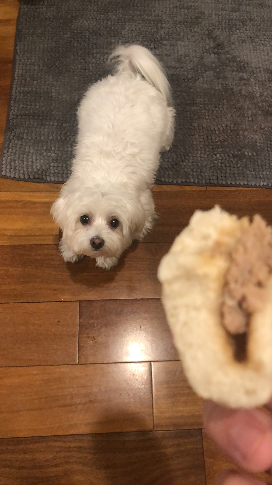

# This is Siying's  website

You can learn about me [here](about.html), which includes my resume [here](https://docs.google.com/viewerng/viewer?url=https://github.com/Lsy0301/Lsy0301.github.io/raw/master/SiyingLi_Resume.pdf)

## I did some simple instacart (department dairy eggs) data analysis

You can view my [dashboard here](https://lsy0301.github.io/dashboard.html)

* I looked only at data from department dairy eggs

* In Fig.1, I used data from refrigerated pudding desserts and had to choose only users with user ID less than 4000 to decrease sample size. I looked at order number in relationship to days since prior order. 

* In Fig.2, I only used data from when days since prior order is zero. I looked at order number and aisle.

* In Fig.3, I counted aisles ordered numbers and ranked them into a bar graph. 

## My dog
By the way, I love dogs. 
 

